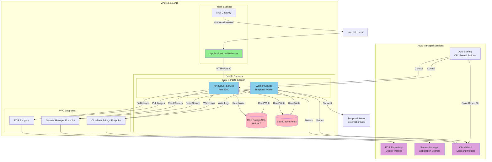

# AWS ECS Deployment Guide

This document outlines how to deploy the Farsight Technical server application to AWS ECS (Elastic Container Service) using AWS CDK.

## Architecture Overview

The deployment consists of several components:

1. **API Server Container** - FastAPI application serving HTTP requests
2. **Temporal Worker Container** - Executes Temporal workflows and activities
3. **Temporal Server** - Workflow orchestration engine (can be deployed separately or as a container)
4. **PostgreSQL** - Database for Temporal and application data (AWS RDS)
5. **Redis** - Cache and conversation history (AWS ElastiCache)

### Architecture Diagram



## Prerequisites

- AWS CLI configured with appropriate permissions
- AWS CDK CLI installed: `npm install -g aws-cdk`
- Docker installed locally
- Python 3.10+ with dependencies installed
- CDK bootstrapped in your AWS account (run `cdk bootstrap` if not already done)

## Step 1: Set Up Secrets in AWS Secrets Manager

Before deploying infrastructure, you need to create and populate the secrets that will be used by the application:

```bash
aws secretsmanager create-secret \
  --name farsight/server-secrets \
  --secret-string '{
    "OPENAI_API_KEY": "your-openai-key",
    "PINECONE_API_KEY": "your-pinecone-key",
    "POSTGRES_PASSWORD": "your-postgres-password",
    "REDIS_PASSWORD": "your-redis-password",
    "API_KEY": "your-api-key"
  }'
```

**Note:** The CDK stack will create the secret structure, but you need to populate it with actual values. Alternatively, you can update the secret after CDK creates it:

```bash
aws secretsmanager put-secret-value \
  --secret-id farsight/server-secrets \
  --secret-string '{
    "OPENAI_API_KEY": "your-openai-key",
    "PINECONE_API_KEY": "your-pinecone-key",
    "POSTGRES_PASSWORD": "your-postgres-password",
    "REDIS_PASSWORD": "your-redis-password",
    "API_KEY": "your-api-key"
  }'
```

## Step 2: Deploy Infrastructure with CDK

The CDK stack automatically creates all necessary AWS resources. This is the recommended approach.

### 2.1 Install Dependencies

From the `server` directory:

```bash
# Install Python dependencies including CDK
uv sync
```

### 2.2 Bootstrap CDK (First Time Only)

If you haven't bootstrapped CDK in your AWS account:

```bash
cdk bootstrap
```

### 2.3 Deploy Infrastructure

Deploy all infrastructure with a single command:

```bash
# From the server directory
cdk deploy
```

The CDK stack will create:
- VPC with public and private subnets
- ECR repository for Docker images
- RDS PostgreSQL database (Multi-AZ, db.t3.medium)
- ElastiCache Redis cluster (cache.t3.micro)
- Secrets Manager secret (structure created, you populate values)
- IAM roles for ECS tasks
- CloudWatch log groups
- ECS Fargate cluster
- ECS task definitions for API server and worker
- ECS services with auto-scaling
- Application Load Balancer with target group
- Security groups with appropriate rules
- VPC endpoints for ECR, CloudWatch Logs, and Secrets Manager
- CloudWatch alarms for monitoring

### 2.4 Configure Stack Parameters (Optional)

You can customize the deployment using CDK context:

```bash
# Set custom region
cdk deploy --context region=us-east-1

# Set custom VPC CIDR
cdk deploy --context vpc_cidr=10.0.0.0/16

# Set database instance class
cdk deploy --context db_instance_class=db.t3.medium

# Set Redis node type
cdk deploy --context redis_node_type=cache.t3.micro

# Set ECR repository name
cdk deploy --context ecr_repo_name=farsight-server

# Set cluster name
cdk deploy --context cluster_name=farsight-cluster

# Set Temporal address (if using external Temporal)
cdk deploy --context temporal_address=temporal.example.com:7233
```

### 2.5 View Stack Outputs

After deployment, CDK will output important information:

- `LoadBalancerDNS`: The DNS name of the Application Load Balancer (use this to access your API)
- `ECRRepositoryURI`: The URI of the ECR repository for pushing Docker images

## Step 3: Build and Push Docker Images

### 3.1 Get ECR Repository URI

After CDK deployment, get the ECR repository URI from the stack outputs or:

```bash
aws ecr describe-repositories --repository-names farsight-server --query 'repositories[0].repositoryUri' --output text
```

### 3.2 Authenticate Docker to ECR

```bash
aws ecr get-login-password --region us-east-1 | docker login --username AWS --password-stdin <account-id>.dkr.ecr.us-east-1.amazonaws.com
```

### 3.3 Build and Push Images

```bash
# Build the server image
cd server
docker build -t farsight-server:latest .

# Tag for ECR (use the ECR repository URI from stack outputs)
docker tag farsight-server:latest <ecr-repository-uri>:latest
docker tag farsight-server:latest <ecr-repository-uri>:${{ github.sha }}

# Push to ECR
docker push <ecr-repository-uri>:latest
docker push <ecr-repository-uri>:${{ github.sha }}
```

## Step 4: Update ECS Services (After Image Push)

After pushing a new image, force ECS services to use it:

```bash
aws ecs update-service \
  --cluster farsight-cluster \
  --service farsight-api-server \
  --force-new-deployment \
  --region us-east-1

aws ecs update-service \
  --cluster farsight-cluster \
  --service farsight-worker \
  --force-new-deployment \
  --region us-east-1
```

## Alternative: Manual Deployment (Without CDK)

If you prefer to deploy manually using AWS CLI, the following sections provide step-by-step instructions. **Note:** CDK deployment is recommended as it handles all dependencies and configurations automatically.

### Manual Step 1: Create ECR Repository

```bash
aws ecr create-repository --repository-name farsight-server --region us-east-1
```

### Manual Step 2: Set Up RDS PostgreSQL Database

Create an RDS PostgreSQL instance for Temporal and application data:

```bash
aws rds create-db-instance \
  --db-instance-identifier farsight-postgres \
  --db-instance-class db.t3.medium \
  --engine postgres \
  --engine-version 14.9 \
  --master-username postgres \
  --master-user-password <secure-password> \
  --allocated-storage 100 \
  --vpc-security-group-ids <security-group-id> \
  --db-subnet-group-name <subnet-group-name> \
  --backup-retention-period 7 \
  --multi-az
```

**Note:** Store database credentials in AWS Secrets Manager for secure access.

### Manual Step 3: Create ElastiCache Redis Cluster

Create an ElastiCache Redis cluster for conversation history:

```bash
aws elasticache create-cache-cluster \
  --cache-cluster-id farsight-redis \
  --cache-node-type cache.t3.micro \
  --engine redis \
  --num-cache-nodes 1 \
  --vpc-security-group-ids <security-group-id> \
  --subnet-group-name <subnet-group-name>
```

### Manual Step 4: Create ECS Task Definitions

#### 4.1 API Server Task Definition

Create `task-definition-api.json`:

```json
{
  "family": "farsight-api-server",
  "networkMode": "awsvpc",
  "requiresCompatibilities": ["FARGATE"],
  "cpu": "512",
  "memory": "1024",
  "executionRoleArn": "arn:aws:iam::<account-id>:role/ecsTaskExecutionRole",
  "taskRoleArn": "arn:aws:iam::<account-id>:role/ecsTaskRole",
  "containerDefinitions": [
    {
      "name": "api-server",
      "image": "<account-id>.dkr.ecr.us-east-1.amazonaws.com/farsight-server:latest",
      "essential": true,
      "portMappings": [
        {
          "containerPort": 8000,
          "protocol": "tcp"
        }
      ],
      "environment": [
        {
          "name": "POSTGRES_HOST",
          "value": "<rds-endpoint>"
        },
        {
          "name": "POSTGRES_PORT",
          "value": "5432"
        },
        {
          "name": "POSTGRES_DB_NAME",
          "value": "farsight"
        },
        {
          "name": "POSTGRES_USER",
          "value": "postgres"
        },
        {
          "name": "REDIS_HOST",
          "value": "<elasticache-endpoint>"
        },
        {
          "name": "REDIS_PORT",
          "value": "6379"
        },
        {
          "name": "TEMPORAL_ADDRESS",
          "value": "<temporal-endpoint>:7233"
        },
        {
          "name": "TEMPORAL_NAMESPACE",
          "value": "default"
        },
        {
          "name": "TEMPORAL_TASK_QUEUE",
          "value": "orchestrator-task-queue"
        },
        {
          "name": "PINECONE_INDEX",
          "value": "default-index"
        }
      ],
      "secrets": [
        {
          "name": "OPENAI_API_KEY",
          "valueFrom": "arn:aws:secretsmanager:us-east-1:<account-id>:secret:farsight/server-secrets:OPENAI_API_KEY::"
        },
        {
          "name": "PINECONE_API_KEY",
          "valueFrom": "arn:aws:secretsmanager:us-east-1:<account-id>:secret:farsight/server-secrets:PINECONE_API_KEY::"
        },
        {
          "name": "POSTGRES_PASSWORD",
          "valueFrom": "arn:aws:secretsmanager:us-east-1:<account-id>:secret:farsight/server-secrets:POSTGRES_PASSWORD::"
        },
        {
          "name": "REDIS_PASSWORD",
          "valueFrom": "arn:aws:secretsmanager:us-east-1:<account-id>:secret:farsight/server-secrets:REDIS_PASSWORD::"
        },
        {
          "name": "API_KEY",
          "valueFrom": "arn:aws:secretsmanager:us-east-1:<account-id>:secret:farsight/server-secrets:API_KEY::"
        }
      ],
      "logConfiguration": {
        "logDriver": "awslogs",
        "options": {
          "awslogs-group": "/ecs/farsight-api-server",
          "awslogs-region": "us-east-1",
          "awslogs-stream-prefix": "ecs"
        }
      },
      "healthCheck": {
        "command": [
          "CMD-SHELL",
          "python -c \"import urllib.request; urllib.request.urlopen('http://localhost:8000/health')\" || exit 1"
        ],
        "interval": 30,
        "timeout": 10,
        "retries": 3,
        "startPeriod": 60
      }
    }
  ]
}
```

Register the task definition:

```bash
aws ecs register-task-definition --cli-input-json file://task-definition-api.json
```

### 4.2 Temporal Worker Task Definition

Create `task-definition-worker.json`:

```json
{
  "family": "farsight-worker",
  "networkMode": "awsvpc",
  "requiresCompatibilities": ["FARGATE"],
  "cpu": "512",
  "memory": "1024",
  "executionRoleArn": "arn:aws:iam::<account-id>:role/ecsTaskExecutionRole",
  "taskRoleArn": "arn:aws:iam::<account-id>:role/ecsTaskRole",
  "containerDefinitions": [
    {
      "name": "temporal-worker",
      "image": "<account-id>.dkr.ecr.us-east-1.amazonaws.com/farsight-server:latest",
      "essential": true,
      "command": ["python", "-m", "src.temporal.worker"],
      "environment": [
        {
          "name": "POSTGRES_HOST",
          "value": "<rds-endpoint>"
        },
        {
          "name": "POSTGRES_PORT",
          "value": "5432"
        },
        {
          "name": "POSTGRES_DB_NAME",
          "value": "farsight"
        },
        {
          "name": "POSTGRES_USER",
          "value": "postgres"
        },
        {
          "name": "REDIS_HOST",
          "value": "<elasticache-endpoint>"
        },
        {
          "name": "REDIS_PORT",
          "value": "6379"
        },
        {
          "name": "TEMPORAL_ADDRESS",
          "value": "<temporal-endpoint>:7233"
        },
        {
          "name": "TEMPORAL_NAMESPACE",
          "value": "default"
        },
        {
          "name": "TEMPORAL_TASK_QUEUE",
          "value": "orchestrator-task-queue"
        },
        {
          "name": "PINECONE_INDEX",
          "value": "default-index"
        }
      ],
      "secrets": [
        {
          "name": "OPENAI_API_KEY",
          "valueFrom": "arn:aws:secretsmanager:us-east-1:<account-id>:secret:farsight/server-secrets:OPENAI_API_KEY::"
        },
        {
          "name": "PINECONE_API_KEY",
          "valueFrom": "arn:aws:secretsmanager:us-east-1:<account-id>:secret:farsight/server-secrets:PINECONE_API_KEY::"
        },
        {
          "name": "POSTGRES_PASSWORD",
          "valueFrom": "arn:aws:secretsmanager:us-east-1:<account-id>:secret:farsight/server-secrets:POSTGRES_PASSWORD::"
        },
        {
          "name": "REDIS_PASSWORD",
          "valueFrom": "arn:aws:secretsmanager:us-east-1:<account-id>:secret:farsight/server-secrets:REDIS_PASSWORD::"
        }
      ],
      "logConfiguration": {
        "logDriver": "awslogs",
        "options": {
          "awslogs-group": "/ecs/farsight-worker",
          "awslogs-region": "us-east-1",
          "awslogs-stream-prefix": "ecs"
        }
      }
    }
  ]
}
```

Register the worker task definition:

```bash
aws ecs register-task-definition --cli-input-json file://task-definition-worker.json
```

### Manual Step 5: Create CloudWatch Log Groups

```bash
aws logs create-log-group --log-group-name /ecs/farsight-api-server
aws logs create-log-group --log-group-name /ecs/farsight-worker
```

### Manual Step 6: Create ECS Cluster

```bash
aws ecs create-cluster --cluster-name farsight-cluster
```

### Manual Step 7: Create ECS Services

### 7.1 API Server Service

```bash
aws ecs create-service \
  --cluster farsight-cluster \
  --service-name farsight-api-server \
  --task-definition farsight-api-server \
  --desired-count 2 \
  --launch-type FARGATE \
  --network-configuration "awsvpcConfiguration={subnets=[<subnet-1>,<subnet-2>],securityGroups=[<security-group-id>],assignPublicIp=ENABLED}" \
  --load-balancers "targetGroupArn=<target-group-arn>,containerName=api-server,containerPort=8000" \
  --health-check-grace-period-seconds 60
```

### 7.2 Worker Service

```bash
aws ecs create-service \
  --cluster farsight-cluster \
  --service-name farsight-worker \
  --task-definition farsight-worker \
  --desired-count 2 \
  --launch-type FARGATE \
  --network-configuration "awsvpcConfiguration={subnets=[<subnet-1>,<subnet-2>],securityGroups=[<security-group-id>],assignPublicIp=DISABLED}"
```

### Manual Step 8: Set Up Application Load Balancer

### 8.1 Create Target Group

```bash
aws elbv2 create-target-group \
  --name farsight-api-tg \
  --protocol HTTP \
  --port 8000 \
  --vpc-id <vpc-id> \
  --target-type ip \
  --health-check-path /health \
  --health-check-interval-seconds 30 \
  --health-check-timeout-seconds 10 \
  --healthy-threshold-count 2 \
  --unhealthy-threshold-count 3
```

### 8.2 Create Load Balancer

```bash
aws elbv2 create-load-balancer \
  --name farsight-alb \
  --subnets <subnet-1> <subnet-2> \
  --security-groups <alb-security-group-id>
```

### 8.3 Create Listener

```bash
aws elbv2 create-listener \
  --load-balancer-arn <alb-arn> \
  --protocol HTTP \
  --port 80 \
  --default-actions Type=forward,TargetGroupArn=<target-group-arn>
```

### Manual Step 9: Configure Auto-Scaling

### 9.1 Register Scalable Targets

```bash
# API Server Auto-Scaling
aws application-autoscaling register-scalable-target \
  --service-namespace ecs \
  --scalable-dimension ecs:service:DesiredCount \
  --resource-id service/farsight-cluster/farsight-api-server \
  --min-capacity 2 \
  --max-capacity 10

# Worker Auto-Scaling
aws application-autoscaling register-scalable-target \
  --service-namespace ecs \
  --scalable-dimension ecs:service:DesiredCount \
  --resource-id service/farsight-cluster/farsight-worker \
  --min-capacity 2 \
  --max-capacity 5
```

### 9.2 Create Scaling Policies

```bash
# API Server CPU-based scaling
aws application-autoscaling put-scaling-policy \
  --service-namespace ecs \
  --scalable-dimension ecs:service:DesiredCount \
  --resource-id service/farsight-cluster/farsight-api-server \
  --policy-name api-server-cpu-scaling \
  --policy-type TargetTrackingScaling \
  --target-tracking-scaling-policy-configuration '{
    "TargetValue": 70.0,
    "PredefinedMetricSpecification": {
      "PredefinedMetricType": "ECSServiceAverageCPUUtilization"
    },
    "ScaleInCooldown": 300,
    "ScaleOutCooldown": 60
  }'
```

## Step 5: Security Considerations

### 10.1 IAM Roles

Create IAM roles with the following permissions:

**ECS Task Execution Role:**
- `AmazonECSTaskExecutionRolePolicy`
- Secrets Manager read access
- ECR pull access
- CloudWatch Logs write access

**ECS Task Role:**
- Custom permissions for accessing AWS services (if needed)
- Secrets Manager read access

### 10.2 Security Groups

Configure security groups to allow:
- ALB → ECS tasks: Port 8000
- ECS tasks → RDS: Port 5432
- ECS tasks → ElastiCache: Port 6379
- ECS tasks → Temporal: Port 7233
- Internet → ALB: Port 80/443

### 10.3 Network Configuration

- Deploy ECS tasks in private subnets
- Use NAT Gateway for outbound internet access
- Place RDS and ElastiCache in private subnets
- Use VPC endpoints for AWS services to reduce NAT costs

## Step 6: Monitoring and Logging

### 11.1 CloudWatch Dashboards

Create dashboards to monitor:
- ECS service metrics (CPU, memory, task count)
- ALB metrics (request count, latency, error rates)
- RDS metrics (CPU, connections, storage)
- ElastiCache metrics (CPU, memory, evictions)

### 11.2 CloudWatch Alarms

Set up alarms for:
- High CPU utilization
- High memory utilization
- Task failures
- Health check failures
- Database connection errors

## Step 7: CI/CD Pipeline

The project includes a GitHub Actions workflow (`.github/workflows/cd.yml`) that automates the deployment process:

1. **Build Stage**: Build Docker image on code push
2. **Test Stage**: Run unit and integration tests (triggered by CI workflow)
3. **Push Stage**: Push image to ECR with both `latest` and commit SHA tags
4. **Deploy Stage**: Deploy infrastructure with CDK and update ECS services

The workflow automatically:
- Builds and pushes Docker images to ECR
- Deploys/updates infrastructure using CDK
- Forces new ECS service deployments to use the latest images

**Required GitHub Secrets:**
- `AWS_ACCESS_KEY_ID`: AWS access key with appropriate permissions
- `AWS_SECRET_ACCESS_KEY`: AWS secret access key
- `AWS_REGION`: AWS region (defaults to us-east-1 if not set)

The workflow is triggered automatically when the CI workflow completes successfully on the `main` branch.

## Step 8: Deployment Verification

After deployment, verify:

1. **Health Checks**: Ensure `/health` endpoint responds
2. **Logs**: Check CloudWatch logs for errors
3. **Metrics**: Monitor ECS service metrics
4. **Connectivity**: Test database and Redis connections
5. **Temporal**: Verify worker can connect to Temporal server
6. **API**: Test API endpoints through ALB

## Cost Optimization Tips

1. **Use Fargate Spot** for non-critical workloads (workers)
2. **Right-size containers** based on actual usage
3. **Enable RDS automated backups** with appropriate retention
4. **Use ElastiCache reserved instances** for predictable workloads
5. **Implement auto-scaling** to scale down during low traffic
6. **Use VPC endpoints** to reduce NAT Gateway costs

## Troubleshooting

### CDK Deployment Issues

- **CDK bootstrap required**: Run `cdk bootstrap` if you see bootstrap errors
- **Permission errors**: Ensure your AWS credentials have sufficient permissions for all resources
- **Stack already exists**: Use `cdk destroy` to remove existing stack before redeploying (be careful!)
- **CloudFormation errors**: Check the CloudFormation console for detailed error messages

### Common Runtime Issues

1. **Tasks failing to start**: Check CloudWatch logs, verify secrets are accessible
2. **Health check failures**: Verify security groups allow traffic, check application logs
3. **Database connection errors**: Verify RDS security group, check credentials in Secrets Manager
4. **High memory usage**: Increase task memory allocation in CDK stack or optimize application
5. **Worker not processing tasks**: Verify Temporal connection, check worker logs

### Useful Commands

```bash
# CDK Commands
cdk synth                    # Generate CloudFormation template
cdk deploy                   # Deploy stack
cdk destroy                  # Destroy stack (careful!)
cdk diff                     # Show differences between deployed and current stack
cdk list                      # List all stacks

# ECS Commands
aws ecs describe-services --cluster farsight-cluster --services farsight-api-server
aws ecs list-tasks --cluster farsight-cluster --service-name farsight-api-server
aws ecs update-service --cluster farsight-cluster --service farsight-api-server --force-new-deployment

# View logs
aws logs tail /ecs/farsight-api-server --follow
aws logs tail /ecs/farsight-worker --follow

# Get stack outputs
aws cloudformation describe-stacks --stack-name FarsightStack --query 'Stacks[0].Outputs'
```

## Next Steps

- Set up HTTPS with ACM certificate and ALB listener
- Configure WAF rules for security
- Set up Route 53 for custom domain
- Implement blue/green deployments
- Add container insights for detailed monitoring
- Set up backup and disaster recovery procedures

